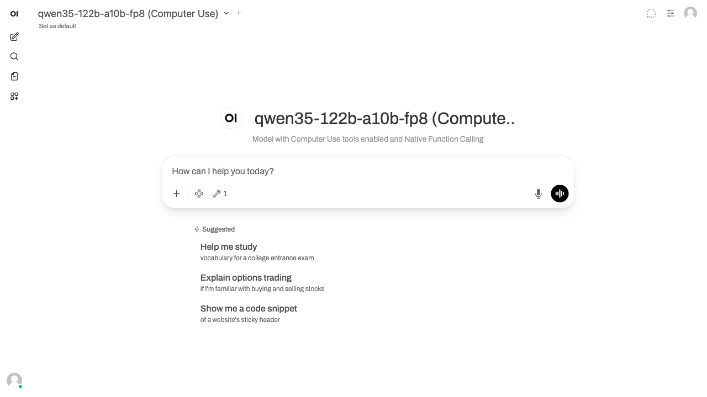
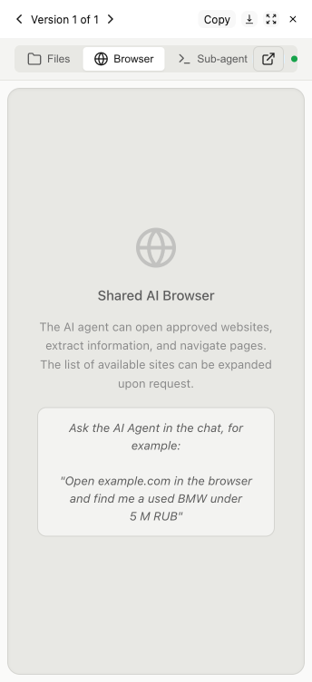
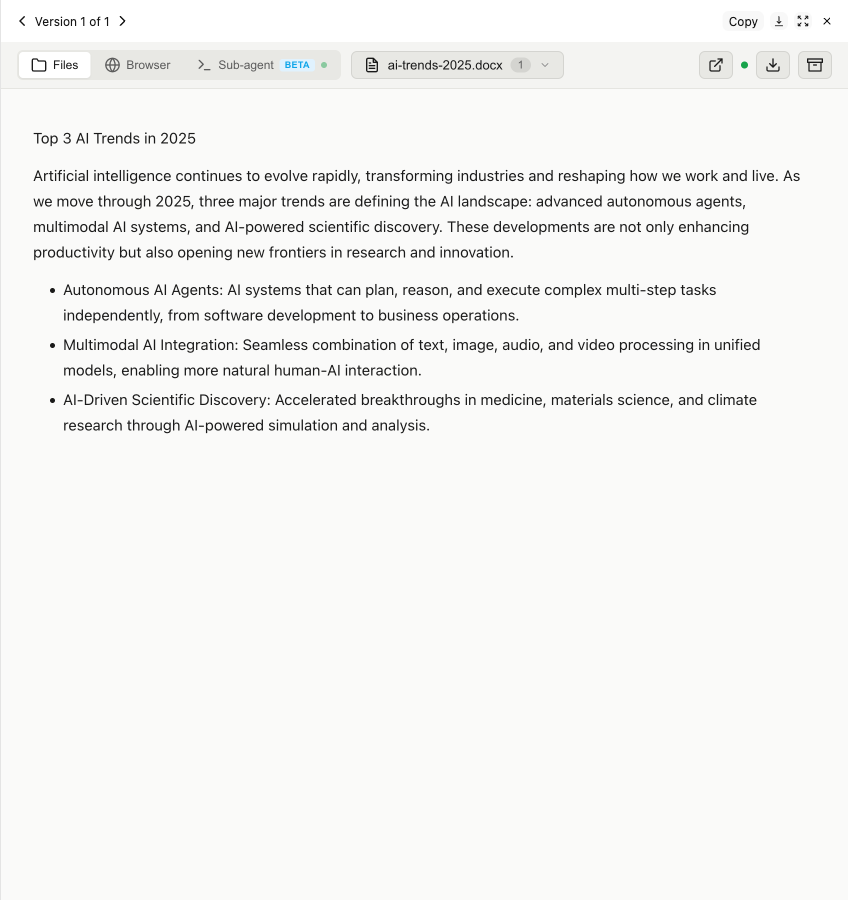
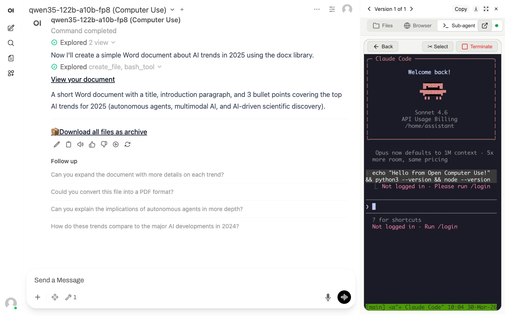
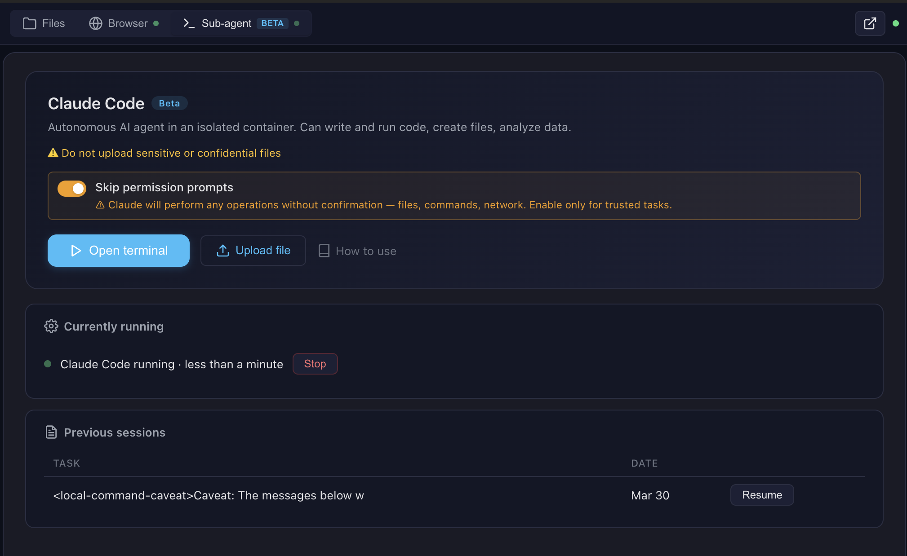
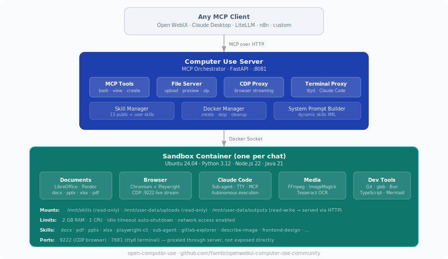

# Open Computer Use

[](https://github.com/Yambr/open-computer-use/actions/workflows/build.yml)
[](https://github.com/Yambr/open-computer-use/actions/workflows/codeql.yml)
[](https://github.com/Yambr/open-computer-use/releases)
[](LICENSE)
[](https://github.com/Yambr/open-computer-use/stargazers)
[](https://github.com/Yambr/open-computer-use/issues)
[](CONTRIBUTING.md)

MCP server that gives any LLM its own computer — managed Docker workspaces with live browser, terminal, code execution, document skills, and autonomous sub-agents. Self-hosted, open-source, pluggable into any model.



## What is this?

An MCP server that gives any LLM a fully-equipped Ubuntu sandbox with isolated Docker containers. Think of it as your AI's computer — it can do everything a developer can do:

- **Execute code** — bash, Python, Node.js, Java in isolated containers
- **Create documents** — Word, Excel, PowerPoint, PDF with professional styling via skills
- **Browse the web** — Playwright + live CDP browser streaming (you see what AI sees in real-time)
- **Run Claude Code** — autonomous sub-agent with interactive terminal, MCP servers auto-configured
- **Use 13+ skills** — battle-tested workflows for document creation, web testing, design, and more

**Built for production multi-user deployments.** Tested with 1,000+ MAU. Each chat session runs in its own isolated Docker container — the AI can install packages, create files, run servers, and nothing leaks between users. Works seamlessly across MCP clients: start with Open WebUI today, switch to Claude Desktop or n8n tomorrow — same backend, no migration.

### Key differentiators

| Feature | Open Computer Use | Claude.ai (Claude Code web) | [open-terminal](https://github.com/open-webui/open-terminal) | OpenAI Operator |
|---------|-------------------|-----------|---------------|-----------------|
| **Self-hosted** | Yes | No | Yes | No |
| **Any LLM** | Yes (OpenAI-compatible) | Claude only | Any (via Open WebUI) | GPT only |
| **Code execution** | Full Linux sandbox | Sandbox (Claude Code web) | Sandbox / bare metal | No |
| **Live browser** | CDP streaming (shared, interactive) | Screenshot-based | No | Screenshot-based |
| **Terminal + Claude Code** | ttyd + tmux + Claude Code CLI | Claude Code web (built-in) | PTY + WebSocket | N/A |
| **Skills system** | 13 built-in (auto-injected) + custom | Built-in skills + custom instructions | Open WebUI native (text-only) | N/A |
| **Container isolation** | Docker (runc), per chat | Docker (gVisor) | Shared container (OS-level users) | N/A |

Works with **any MCP-compatible client**: Open WebUI, Claude Desktop, LiteLLM, n8n, or your own integration. See [docs/COMPARISON.md](docs/COMPARISON.md) for a detailed comparison with alternatives.

### Live browser streaming



### File preview with skills



### Claude Code — interactive terminal in the cloud



### Sub-agent dashboard — monitor and control



See [docs/FEATURES.md](docs/FEATURES.md) for architecture details and [docs/SCREENSHOTS.md](docs/SCREENSHOTS.md) for all screenshots.

> **Pro tip**: Create skills with Claude Code in the terminal, then use them with any model in the chat. Skills are model-agnostic — write once, use everywhere.

## Architecture



## Quick Start

```bash
git clone https://github.com/Yambr/open-computer-use.git
cd open-computer-use
cp .env.example .env
# Edit .env — set OPENAI_API_KEY (or any OpenAI-compatible provider)

# 1. Start Computer Use Server (builds workspace image on first run, ~15 min)
docker compose up --build

# 2. Start Open WebUI (in another terminal)
docker compose -f docker-compose.webui.yml up --build
```

Open http://localhost:3000 — Open WebUI with Computer Use ready to go.

> **Note:** Two separate docker-compose files: `docker-compose.yml` (Computer Use Server) and `docker-compose.webui.yml` (Open WebUI). They communicate via `localhost:8081`. This mirrors real deployments where the server and UI run on different hosts.

### Model Settings (important!)

After adding a model in Open WebUI, go to **Model Settings** and set:

| Setting | Value | Why |
|---------|-------|-----|
| **Function Calling** | `Native` | Required for Computer Use tools to work |
| **Stream Chat Response** | `On` | Enables real-time output streaming |

Without `Function Calling: Native`, the model won't invoke Computer Use tools.

## What's Inside the Sandbox


| Category | Tools |
|----------|-------|
| **Languages** | Python 3.12, Node.js 22, Java 21, Bun |
| **Documents** | LibreOffice, Pandoc, python-docx, python-pptx, openpyxl |
| **PDF** | pypdf, pdf-lib, reportlab, tabula-py, ghostscript |
| **Images** | Pillow, OpenCV, ImageMagick, sharp, librsvg |
| **Web** | Playwright (Chromium), Mermaid CLI |
| **AI** | Claude Code CLI, Playwright MCP |
| **OCR** | Tesseract (configurable languages) |
| **Media** | FFmpeg |
| **Diagrams** | Graphviz, Mermaid |
| **Dev** | TypeScript, tsx, git |

## Skills

13 built-in public skills + 14 examples:

| Skill | Description |
|-------|-------------|
| **pptx** | Create/edit PowerPoint presentations with html2pptx |
| **docx** | Create/edit Word documents with tracked changes |
| **xlsx** | Create/edit Excel spreadsheets with formulas |
| **pdf** | Create, fill forms, extract, merge PDFs |
| **sub-agent** | Delegate complex tasks to Claude Code |
| **playwright-cli** | Browser automation and web scraping |
| **describe-image** | Vision API image analysis |
| **frontend-design** | Build production-grade UIs |
| **webapp-testing** | Test web applications with Playwright |
| **doc-coauthoring** | Structured document co-authoring workflow |
| **test-driven-development** | TDD methodology enforcement |
| **skill-creator** | Create custom skills |
| **gitlab-explorer** | Explore GitLab repositories |

**14 example skills**: web-artifacts-builder, copy-editing, social-content, canvas-design, algorithmic-art, theme-factory, mcp-builder, and more.

See [docs/SKILLS.md](docs/SKILLS.md) for details.

## MCP Integration

The server speaks standard MCP over Streamable HTTP. Connect it to anything:

```bash
# Test with curl
curl -X POST http://localhost:8081/mcp \
  -H "Content-Type: application/json" \
  -H "X-Chat-Id: test" \
  -d '{"jsonrpc":"2.0","id":1,"method":"initialize","params":{"protocolVersion":"2024-11-05","capabilities":{},"clientInfo":{"name":"test","version":"1.0"}}}'
```

See [docs/MCP.md](docs/MCP.md) for full integration guide (LiteLLM, Claude Desktop, custom clients).

## Configuration

All settings via `.env`:

| Variable | Default | Description |
|----------|---------|-------------|
| `OPENAI_API_KEY` | — | LLM API key (any OpenAI-compatible) |
| `OPENAI_API_BASE_URL` | — | Custom API base URL (OpenRouter, etc.) |
| `MCP_API_KEY` | — | Bearer token for MCP endpoint |
| `DOCKER_IMAGE` | `open-computer-use:latest` | Sandbox container image |
| `COMMAND_TIMEOUT` | `120` | Bash tool timeout (seconds) |
| `SUB_AGENT_TIMEOUT` | `3600` | Sub-agent timeout (seconds) |
| `SINGLE_USER_MODE` | — | `true` = one container, no chat ID needed; `false` = require X-Chat-Id; unset = lenient |
| `PUBLIC_BASE_URL` | `http://computer-use-server:8081` | Browser-reachable URL of the Computer Use server. Baked into `/system-prompt` and returned to the Open WebUI filter in the `X-Public-Base-URL` response header — **single source of truth** for the public URL. [Open WebUI filter URL requirements](docs/openwebui-filter.md#two-file_server_url-settings--they-must-match). |
| `CHAT_RESPONSE_MAX_TOOL_CALL_RETRIES`, `ORCHESTRATOR_URL`, `TOOL_RESULT_MAX_CHARS`, `TOOL_RESULT_PREVIEW_CHARS`, build-arg `COMPUTER_USE_SERVER_URL` | — | Settings on the **`open-webui` container** (not CU-server). Required when embedding — see [Required setup when embedding Open WebUI](#required-setup-when-embedding-open-webui-into-your-own-stack). |
| `POSTGRES_PASSWORD` | `openwebui` | PostgreSQL password |
| `VISION_API_KEY` | — | Vision API key (for describe-image) |
| `ANTHROPIC_AUTH_TOKEN` | — | Anthropic key (for Claude Code sub-agent) |
| `MCP_TOKENS_URL` | — | Settings Wrapper URL (optional, see below) |
| `MCP_TOKENS_API_KEY` | — | Settings Wrapper auth key |

### Custom Skills & Token Management (optional)

By default, all 13 built-in skills are available to everyone. For per-user skill access and custom skills, deploy the **Settings Wrapper** — see [settings-wrapper/README.md](settings-wrapper/README.md).

**Personal Access Tokens (PATs):** The settings wrapper can also store encrypted per-user PATs for external services (GitLab, Confluence, Jira, etc.). The server fetches them by user email and injects into the sandbox — so each user's AI has access to their repos/docs without sharing credentials. The server-side code for token injection is implemented (`docker_manager.py`), but the Open WebUI tool doesn't pass the required headers yet. This is on the roadmap — if you need PAT management, [open an issue](https://github.com/Yambr/open-computer-use/issues).

## MCP Client Integrations

The Computer Use Server speaks standard **MCP over Streamable HTTP** — any MCP-compatible client can connect. Open WebUI is the primary tested frontend, but not the only option.

| Client | How to connect | Status |
|--------|---------------|--------|
| [**Open WebUI**](https://github.com/open-webui/open-webui) | Docker Compose stack included, auto-configured | Tested in production |
| [**Claude Desktop**](https://claude.ai/download) | Add to `claude_desktop_config.json` — see [docs/MCP.md](docs/MCP.md) | Works |
| [**n8n**](https://n8n.io) | MCP Tool node → `http://computer-use-server:8081/mcp` | Works |
| [**LiteLLM**](https://github.com/BerriAI/litellm) | MCP proxy config — see [docs/MCP.md](docs/MCP.md) | Works |
| **Custom client** | Any HTTP client with MCP JSON-RPC — see curl examples in [docs/MCP.md](docs/MCP.md) | Works |

## Open WebUI Integration

> **[Open WebUI](https://github.com/open-webui/open-webui)** is an extensible, self-hosted AI interface. We use it as the primary frontend because it supports tool calling, function filters, and artifacts — everything needed for Computer Use.

**Compatibility:** Tested with Open WebUI v0.8.11–0.8.12. Set `OPENWEBUI_VERSION` in `.env` to pin a specific version.

**Why not a fork?** We intentionally did not fork Open WebUI. Instead, everything is bolted on via the official plugin API (tools + functions) and build-time patches for missing features. This means you can use stock [Open WebUI](https://github.com/open-webui/open-webui) versions v0.8.11–0.8.12 (tested) — just install the tool and filter. Patches are applied at Docker build time; strongly recommended — 4 of them affect user-visible UX (artifacts panel, preview iframe, error banners, large tool-result handling). Pulling `ghcr.io/open-webui/open-webui` directly skips all of them — see [Required setup when embedding Open WebUI](#required-setup-when-embedding-open-webui-into-your-own-stack) for the full checklist.

Running Claude Code through a corporate gateway (LiteLLM, Azure, Bedrock)? See [docs/claude-code-gateway.md](docs/claude-code-gateway.md) for the three-path operator recipe.

The `openwebui/` directory contains:

- **tools/** — MCP client tool (thin proxy to Computer Use Server). **Required** — this is the bridge between Open WebUI and the sandbox.
- **functions/** — System prompt injector + file link rewriter + archive button. **Required** — without it the model doesn't know about skills and file URLs.
- **patches/** — Build-time fixes for artifacts, error handling, file preview. **Optional** but recommended — improves UX significantly.
- **init.sh** — Auto-installs tool + filter on first startup. **Optional** — you can install manually via Workspace UI instead.
- **Dockerfile** — Builds a patched Open WebUI image with auto-init. **Optional** — use stock Open WebUI + manual setup if you prefer.

### How auto-init works

On first `docker compose up`, the init script automatically:

1. Creates an admin user (`admin@open-computer-use.dev` / `admin`)
2. Installs the Computer Use tool via `POST /api/v1/tools/create`
3. Installs the Computer Use filter via `POST /api/v1/functions/create`
4. Configures tool and filter valves (`ORCHESTRATOR_URL=http://computer-use-server:8081` — internal URL for server↔server, seeded into both Valves)
5. Marks the tool **public-read** (access grants for both `group:*` and `user:*` wildcards) — so non-admin users see the tool in their workspace
6. Marks the filter both **active and global** (two separate toggles: `/toggle` and `/toggle/global`) — active-but-not-global is silently inert and a common manual-setup mistake
7. Merges `{function_calling: "native", stream_response: true}` into `DEFAULT_MODEL_PARAMS` via `POST /api/v1/configs/models` — every model gets the right defaults without per-model Advanced Params clicks

A marker file (`.computer-use-initialized`) prevents re-running on subsequent starts.

> **Note:** Open WebUI doesn't support pre-installed tools from the filesystem — they must be loaded via the REST API. The init script automates this so you don't have to do it manually.

### Manual setup (if not using docker-compose)

If you run Open WebUI separately, you need to manually:

1. Go to **Workspace > Tools** → Create new tool → paste contents of `openwebui/tools/computer_use_tools.py`
2. Set **Tool ID** to `ai_computer_use` (required for filter to work)
3. Configure **Valves**: `ORCHESTRATOR_URL` = internal URL of your Computer Use Server (`http://computer-use-server:8081` for Docker compose)
4. Open the tool's **⋯ → Share** menu and set access to **Public** (grants read to both `group:*` and `user:*` wildcards) — otherwise only your admin account sees the tool and non-admin users get an empty tool list with no error
5. Go to **Workspace > Functions** → Create new function → paste `openwebui/functions/computer_link_filter.py`
6. Enable the filter: toggle **Active** *and* toggle **Global** in the Functions list — these are two separate switches, and active-but-not-global means the filter loads but is never applied to chats
7. In your model settings, set **Function Calling** = `Native` and **Stream Chat Response** = `On`. Or set them globally once in **Admin → Settings → Models → Advanced Params** (`function_calling: native`, `stream_response: true`) — that becomes `DEFAULT_MODEL_PARAMS` for every model.

The docker-compose stack handles all of this automatically.

### Required setup when embedding Open WebUI into your own stack

If you run Open WebUI outside the stock `docker-compose.webui.yml` — your own compose, Kubernetes, Portainer, or a downstream repo — there are **four traps** that will silently break Computer Use. All four hit us in production. Check in this order.

#### Step 1 — Build the image from `openwebui/Dockerfile`, don't pull upstream

Pulling `ghcr.io/open-webui/open-webui:vX.Y.Z` gives you a stock image **without** any of this repo's patches. Four of them are critical for UX:

| Patch | Without it |
|-------|------------|
| `fix_artifacts_auto_show` | HTML/iframe renders as raw text in chat body instead of the artifacts panel |
| `fix_preview_url_detection` | Preview iframe is never auto-inserted after file links |
| `fix_tool_loop_errors` | Raw exceptions instead of banners; `MCP call failed: Session terminated` appears unwrapped |
| `fix_large_tool_results` | `TOOL_RESULT_MAX_CHARS` / `DOCKER_AI_UPLOAD_URL` become no-ops; large outputs wreck the model context |

Only `CHAT_RESPONSE_MAX_TOOL_CALL_RETRIES` keeps working on an upstream image (it's a stock Open WebUI env) — which creates a false "everything is configured" feeling.

Use `build:` in your downstream compose, mirroring `docker-compose.webui.yml:11-15`:

```yaml
services:
  open-webui:
    build:
      context: ./openwebui   # path into this repo
      dockerfile: Dockerfile
      args:
        OPENWEBUI_VERSION: "0.8.12"
        COMPUTER_USE_SERVER_URL: "cu.your-domain.com"   # see Step 2 — NOT an internal hostname
    image: open-webui-with-cu-patches:latest   # local tag, do not pull
```

Verify the patches are baked into the running container:

```bash
docker exec open-webui bash -c \
  'grep -l "bn.set(!0),Jr.set(!0)" /app/build/_app/immutable/chunks/*.js >/dev/null \
   && echo "patches applied" || echo "MISSING — you are on upstream image"'
```

The `bn.set(!0),Jr.set(!0)` marker is injected by `fix_artifacts_auto_show` into the minified Svelte chunks at build time. Empty output = stock upstream image, not ours.

#### Step 2 — Set `COMPUTER_USE_SERVER_URL` build-arg to the PUBLIC domain (counterintuitive)

This is the most confusing trap. `COMPUTER_USE_SERVER_URL` is a **build argument** in `openwebui/Dockerfile:16-17` that — despite the name — is **not** a network endpoint. It is compiled into a regex inside the minified Svelte chunks by `openwebui/patches/fix_preview_url_detection.py:54`. The regex searches assistant messages for links of the form `{COMPUTER_USE_SERVER_URL}/(files|preview)/...` and triggers the preview iframe.

The model writes whatever URL the Computer Use Server injected into the system prompt — i.e. the server's `PUBLIC_BASE_URL`, which is your **public** domain. So the regex must match that public domain, not the internal Docker service name.

| Environment | Correct value |
|-------------|---------------|
| Production with domain | `cu.your-domain.com` (no scheme — the regex wraps it) |
| Local dev (Docker Desktop) | `localhost:8081` (the default) |

⚠️ If you change this after an initial build, you **must rebuild the image** (`docker compose up -d --build open-webui`) — the value is compiled into chunks, not read at runtime.

Verify:

```bash
docker exec open-webui bash -c \
  'grep -oE "[a-z0-9.:-]+\\\\/\\(files\\|preview" /app/build/_app/immutable/chunks/*.js | head -1'
# → should contain your public domain (e.g. cu.your-domain.com), NOT computer-use-server:8081
```

#### Step 3 — Three URL settings, two roles (public vs internal)

**v4.0.0:** the old "three `FILE_SERVER_URL` places that must match" footgun is gone. There are now only **three** places and **two** distinct roles — public (browser-reachable) vs internal (Docker-local).

| Where | Role | Who reads it | Prod (with domain) | Local dev (Docker Desktop) |
|-------|------|-------------|--------------------|----------------------------|
| `PUBLIC_BASE_URL` env on the **`computer-use-server`** container (`docker-compose.yml` / `.env`) | **PUBLIC** — baked into `/system-prompt` links + returned to filter via `X-Public-Base-URL` response header | Server (single source of truth for public URL) | `https://cu.your-domain.com` | `http://localhost:8081` |
| Build-arg `COMPUTER_USE_SERVER_URL` (docker-compose `build.args` for `open-webui`) | **PUBLIC** — compiled into Svelte regex by `fix_preview_url_detection`; must match what the model emits | Open WebUI (text match in assistant messages) | `cu.your-domain.com` (no scheme) | `localhost:8081` |
| Filter + Tool Valves `ORCHESTRATOR_URL` (seeded by `init.sh` from `ORCHESTRATOR_URL` env on the open-webui container) | **INTERNAL** — server↔server fetch of `/system-prompt`; MCP `tools/call` forwarding | Filter and tool (Docker network) | `http://computer-use-server:8081` | `http://computer-use-server:8081` |

⚠️ **Do NOT point `ORCHESTRATOR_URL` at your public domain.** It technically works, but every MCP request then goes browser→CDN→Traefik→container. Any hiccup in that chain kills the stream mid-tool-call and the user sees `MCP call failed: Session terminated`. Stay inside the Docker network.

⚠️ **Do NOT set the build-arg to the internal service name.** The regex will then look for `computer-use-server:8081/files/...` in assistant text, but the model writes whatever is in the server's `PUBLIC_BASE_URL` — your public domain. Mismatch → preview never renders, user sees raw `<iframe>` text in chat.

The filter no longer has a public-URL Valve at all — it reads the public URL from the server's `X-Public-Base-URL` response header and caches it alongside the prompt. One public knob, one internal knob.

See also [docs/openwebui-filter.md](docs/openwebui-filter.md#two-file_server_url-settings--they-must-match).

#### Step 4 — Four env vars on the `open-webui` container

Copy-paste into your downstream compose `environment:` block:

```yaml
services:
  open-webui:
    environment:
      # --- Computer Use required env vars (read by build-time patches) ---
      - CHAT_RESPONSE_MAX_TOOL_CALL_RETRIES=200
      - TOOL_RESULT_MAX_CHARS=50000
      - TOOL_RESULT_PREVIEW_CHARS=2000
      # Internal URL of the Computer Use server — seeded by init.sh into both
      # Tool and Filter Valves, and read by the fix_large_tool_results patch.
      # Same Docker network: use the service DNS name.
      - ORCHESTRATOR_URL=http://computer-use-server:8081
```

| Variable | Default if unset | Effect when correctly set |
|----------|------------------|---------------------------|
| `CHAT_RESPONSE_MAX_TOOL_CALL_RETRIES` | `30` (upstream) | Tool-call cap per turn. `30` cuts Computer Use multi-step tasks short; stock repo uses `200`. |
| `TOOL_RESULT_MAX_CHARS` | `50000` (patch built-in) | Truncation threshold above which a tool result is truncated or uploaded. `0` disables. |
| `TOOL_RESULT_PREVIEW_CHARS` | `2000` (patch built-in) | Preview size the model sees after truncation or upload. |
| `ORCHESTRATOR_URL` | empty | Seeded into both Tool and Filter Valves by `init.sh`, and read by `fix_large_tool_results` patch as the upload target. If empty, oversized results are **silently truncated** — the model loses the data. |

> Note: the last three are **no-ops if the image is upstream ghcr.io** — they need `fix_large_tool_results` from Step 1.

#### Step 5 — Filter must be global, tool must be public-read

Open WebUI has **two separate switches** for each function (`is_active` and `is_global`) and **two required grants** for each tool (`group:*` + `user:*`). The stock `init.sh` does this for you; manual / custom deployments commonly miss one side and then spend hours wondering why "everything is installed but nothing works."

| Resource | What to flip | UI path | Endpoint | Why |
|----------|--------------|---------|----------|-----|
| Filter `computer_use_filter` | `is_active = true` **AND** `is_global = true` | Admin → Functions → `computer_use_filter` → toggle **Active** + toggle **Global** | `POST /api/v1/functions/id/computer_use_filter/toggle` + `.../toggle/global` | `is_active` only loads the function; `is_global` actually applies it to every chat. Active-but-not-global is silently inert with no log line. |
| Tool `ai_computer_use` | access_grants for `group:*` **AND** `user:*`, `permission: read` | Workspace → Tools → `ai_computer_use` → **⋯ → Share → Public** | `POST /api/v1/tools/id/ai_computer_use/access/update` with `{"access_grants":[{"principal_type":"group","principal_id":"*","permission":"read"},{"principal_type":"user","principal_id":"*","permission":"read"}]}` | Without grants, only the admin account that created the tool sees it. Non-admin users get an empty tool list and no error. The UI "Public" toggle writes both wildcards; writing only one leaves the tool visible to some users and invisible to others depending on Open WebUI version. |

Verify against the database (Postgres used by the stock stack; see `docker-compose.webui.yml:53`):

```bash
# Filter flags — expect (t, t):
docker exec <postgres-container> psql -U openwebui -d openwebui -c \
  "SELECT is_active, is_global FROM function WHERE id='computer_use_filter';"

# Tool grants — expect TWO rows (group|* and user|*, both 'read'):
docker exec <postgres-container> psql -U openwebui -d openwebui -c \
  "SELECT principal_type, principal_id, permission FROM access_grant WHERE resource_id='ai_computer_use';"
```

For SQLite-backed Open WebUI deployments, swap `psql` for `sqlite3 /app/backend/data/webui.db` with the same SQL.

#### Step 6 — Verify everything at once

```bash
# 1. Image has patches:
docker exec open-webui bash -c \
  'grep -l "bn.set(!0),Jr.set(!0)" /app/build/_app/immutable/chunks/*.js >/dev/null \
   && echo OK || echo MISSING'

# 2. Build-arg baked into regex matches your public domain:
docker exec open-webui bash -c \
  'grep -oE "[a-z0-9.:-]+\\\\/\\(files\\|preview" /app/build/_app/immutable/chunks/*.js | head -1'

# 3. Env vars reached the container:
docker exec open-webui env | grep -E 'CHAT_RESPONSE_MAX_TOOL_CALL_RETRIES|TOOL_RESULT_|ORCHESTRATOR_URL'

# 4. Tool+Filter Valve (Session-terminated trap) — Admin UI is simplest:
#    Workspace → Tools → ai_computer_use → Valves → ORCHESTRATOR_URL
#    Admin → Functions → computer_link_filter → Valves → ORCHESTRATOR_URL
#    → both must be http://computer-use-server:8081 (internal URL, Docker service DNS),
#      NOT your public domain.

# 5. Server env (baked into system prompt AND returned to filter via header):
docker exec computer-use-server env | grep ^PUBLIC_BASE_URL=
# → must equal your public URL (matches the build-arg from #2).

# 7. Filter is ACTIVE *and* GLOBAL (see Step 5):
docker exec <postgres-container> psql -U openwebui -d openwebui -c \
  "SELECT is_active, is_global FROM function WHERE id='computer_use_filter';"
# → expect (t, t). Two 't's, not one.

# 8. Tool is public-read with both wildcards (see Step 5):
docker exec <postgres-container> psql -U openwebui -d openwebui -c \
  "SELECT principal_type, principal_id, permission FROM access_grant WHERE resource_id='ai_computer_use';"
# → expect TWO rows: (group, *, read) and (user, *, read).
```

> After rebuilding the image, do a **hard reload** in the browser (Cmd+Shift+R / Ctrl+Shift+R). Otherwise it keeps the old cached JS chunks and you'll think the fix didn't work.

#### Symptom → which step is wrong

| Symptom | Step |
|---------|------|
| HTML artifact renders as raw `<iframe ...>` text in chat | 1 (upstream image) — **if not** → 2 (build-arg wrong) |
| Preview iframe auto-insertion doesn't happen for file links | 2 (build-arg mismatched with what model emits) |
| `MCP call failed: Session terminated` on every tool call | 3 (tool Valve points at public domain) |
| Tool loop cuts off at ~30 calls; banner *"Model temporarily unavailable"* | 4 (`CHAT_RESPONSE_MAX_TOOL_CALL_RETRIES` not set) |
| Large tool outputs silently `...(truncated)`; model makes wrong decisions | 4 (`ORCHESTRATOR_URL` not set or unreachable) OR 1 (`fix_large_tool_results` missing) |
| Tool-loop errors show raw Python exception | 1 (`fix_tool_loop_errors` missing) |
| Tool list is empty for non-admin users (admin sees it) | 5 (tool missing `access_grant`s — not public-read) |
| Filter looks "Active" in UI but preview iframe / archive button never appear | 5 (filter `is_global=false` — only `is_active=true` was flipped) |
| File links in chat go to 404 / white screen | `PUBLIC_BASE_URL` on the server doesn't match what the browser can reach — see [docs/openwebui-filter.md](docs/openwebui-filter.md#two-file_server_url-settings--they-must-match) |
| New behavior didn't appear even after rebuild | Browser cached old JS — hard reload |

## Security Notes

> **Production tested** with 1000+ users on Open WebUI in a self-hosted environment. For public-facing deployments, see the hardening roadmap below.

### Current model

- **Docker socket**: The server needs Docker socket access to manage sandbox containers. This grants significant host access — run in a trusted environment only.
- **MCP_API_KEY**: Set a strong random key in production. Without it, anyone with network access to port 8081 can execute arbitrary commands in containers.
- **Sandbox isolation**: Each chat session runs in a separate container with resource limits (2GB RAM, 1 CPU). Containers use standard Docker runtime (runc), not gVisor — they share the host kernel. For stronger isolation, consider switching to gVisor runtime (see roadmap). Containers have network access by default.
- **POSTGRES_PASSWORD**: Change the default password in `.env` for production.

### Known limitations

- **Unauthenticated file/preview endpoints**: `/files/{chat_id}/`, `/api/outputs/{chat_id}`, `/browser/{chat_id}/`, `/terminal/{chat_id}/` — accessible to anyone who knows the chat ID. Chat IDs are UUIDs (hard to guess but not a real security boundary).
- **No per-user auth on server**: The MCP server trusts whoever sends a valid `MCP_API_KEY`. User identity (`X-User-Email`) is passed by the client but not verified server-side.
- **Credentials in HTTP headers**: API keys (GitLab, Anthropic, MCP tokens) are passed as HTTP headers from client to server. Safe within Docker network, but use HTTPS if exposing externally.
- **Default admin credentials**: `admin@open-computer-use.dev` / `admin` — change immediately in multi-user setups.

### Security roadmap

We plan to address these in future releases:

- [ ] **Per-session signed tokens** for file/preview/terminal endpoints (replace chat ID as auth)
- [ ] **Server-side user verification** via Open WebUI JWT validation
- [ ] **HTTPS support** with automatic TLS certificates
- [ ] **Audit logging** for all tool calls and file access
- [ ] **Network policies** for sandbox containers (restrict egress by default)
- [ ] **Secret management** — move credentials from headers to encrypted server-side storage
- [ ] **gVisor (runsc) runtime** — optional container sandboxing for stronger isolation (like Claude.ai)

Ideas? Open a [GitHub Issue](https://github.com/Yambr/open-computer-use/issues). Want to contribute? See [CONTRIBUTING.md](CONTRIBUTING.md) or reach out on Telegram [@yambrcom](https://t.me/yambrcom).

## Development

```bash
# Build workspace image locally
docker build --platform linux/amd64 -t open-computer-use:latest .

# Run tests
./tests/test-docker-image.sh open-computer-use:latest
./tests/test-no-corporate.sh
./tests/test-project-structure.sh

# Build and run full stack
docker compose up --build
```

## Contributing

See [CONTRIBUTING.md](CONTRIBUTING.md). PRs welcome!

## Community

- **Issues & Ideas**: [GitHub Issues](https://github.com/Yambr/open-computer-use/issues)
- **Telegram**: [@yambrcom](https://t.me/yambrcom)

## License

This project uses a multi-license model:

- **Core** (`computer-use-server/`, `openwebui/`, `settings-wrapper/`, Docker configs): [Business Source License 1.1](LICENSE) — free for production use, modification, and self-hosting. Converts to [Apache 2.0](LICENSE-APACHE) on the Change Date. Offering as a managed/hosted service requires a [commercial agreement](https://t.me/yambrcom).
- **Our skills** (`skills/public/describe-image`, `skills/public/sub-agent`): [MIT](LICENSE-MIT)
- **Third-party skills**: see individual LICENSE.txt files or original sources.

**Attribution required**: include "Open Computer Use" and a link to this repository.

See [NOTICE](NOTICE) for details.
