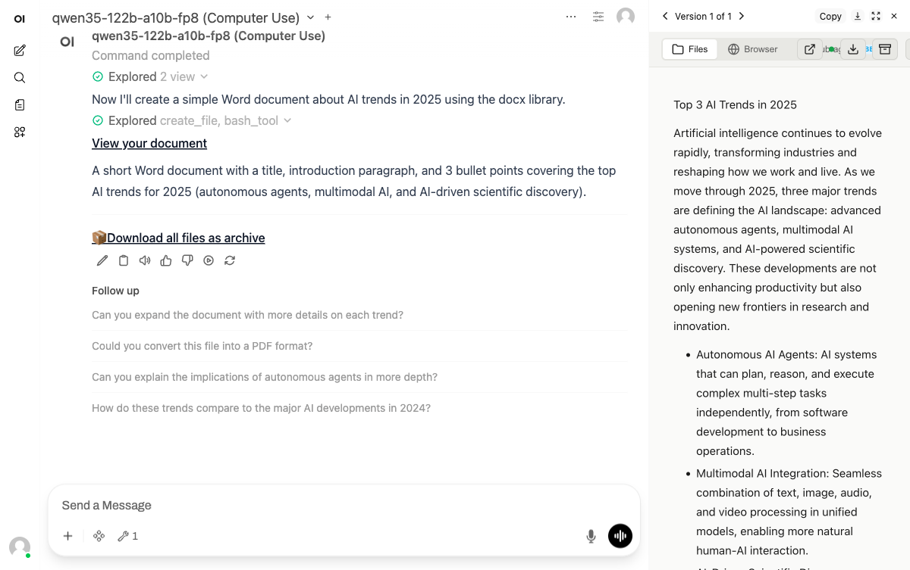

# Open Computer Use

Self-hosted AI workspace with code execution, document creation, browser control, and autonomous agents — like **OpenAI Operator** + **Claude Computer Use** + **Claude Code**, but open-source and pluggable into any LLM.

## What is this?

An MCP server that gives any LLM a fully-equipped Ubuntu sandbox with isolated Docker containers. Think of it as your AI's computer — it can do everything a developer can do:

- **Execute code** — bash, Python, Node.js, Java in isolated containers
- **Create documents** — Word, Excel, PowerPoint, PDF with professional styling via skills
- **Browse the web** — Playwright + live CDP browser streaming (you see what AI sees in real-time)
- **Run Claude Code** — autonomous sub-agent with interactive terminal, MCP servers auto-configured
- **Use 13+ skills** — battle-tested workflows for document creation, web testing, design, and more

### Key differentiators

| Feature | Open Computer Use | Claude.ai | OpenAI Operator |
|---------|-------------------|-----------|-----------------|
| **Self-hosted** | Yes | No | No |
| **Any LLM** | Yes (OpenAI-compatible) | Claude only | GPT only |
| **Code execution** | Full Linux sandbox | Limited | No |
| **Live browser view** | CDP streaming | Screenshot-based | Screenshot-based |
| **Sub-agent (Claude Code)** | Interactive TTY + MCP | N/A | N/A |
| **Skills system** | 13 built-in + custom | N/A | N/A |
| **File preview** | Auto artifacts panel | Download only | N/A |

Works with **any MCP-compatible client**: Open WebUI, Claude Desktop, LiteLLM, n8n, or your own integration.

> **Pro tip**: Create skills with Claude Code in the terminal, then use them with any model in the chat. Skills are model-agnostic — write once, use everywhere.



See [docs/SCREENSHOTS.md](docs/SCREENSHOTS.md) for more screenshots.

## Quick Start

```bash
git clone https://github.com/Yambr/openwebui-computer-use-community.git
cd openwebui-computer-use-community
cp .env.example .env
# Edit .env — set OPENAI_API_KEY (or any OpenAI-compatible provider)

# 1. Start Computer Use Server (builds workspace image on first run, ~15 min)
docker compose up --build

# 2. Start Open WebUI (in another terminal)
docker compose -f docker-compose.webui.yml up --build
```

Open http://localhost:3000 — Open WebUI with Computer Use ready to go.

> **Note:** Two separate docker-compose files: `docker-compose.yml` (Computer Use Server) and `docker-compose.webui.yml` (Open WebUI). They communicate via `localhost:8081`. This mirrors real deployments where the server and UI run on different hosts.

### Model Settings (important!)

After adding a model in Open WebUI, go to **Model Settings** and set:

| Setting | Value | Why |
|---------|-------|-----|
| **Function Calling** | `Native` | Required for Computer Use tools to work |
| **Stream Chat Response** | `On` | Enables real-time output streaming |

Without `Function Calling: Native`, the model won't invoke Computer Use tools.

## Architecture


## What's Inside the Sandbox


| Category | Tools |
|----------|-------|
| **Languages** | Python 3.12, Node.js 22, Java 21, Bun |
| **Documents** | LibreOffice, Pandoc, python-docx, python-pptx, openpyxl |
| **PDF** | pypdf, pdf-lib, reportlab, tabula-py, ghostscript |
| **Images** | Pillow, OpenCV, ImageMagick, sharp, librsvg |
| **Web** | Playwright (Chromium), Mermaid CLI |
| **AI** | Claude Code CLI, Playwright MCP |
| **OCR** | Tesseract (English + Russian) |
| **Media** | FFmpeg |
| **Diagrams** | Graphviz, Mermaid |
| **Dev** | TypeScript, tsx, git, glab |

## Skills

13 built-in public skills + 14 examples:

| Skill | Description |
|-------|-------------|
| **pptx** | Create/edit PowerPoint presentations with html2pptx |
| **docx** | Create/edit Word documents with tracked changes |
| **xlsx** | Create/edit Excel spreadsheets with formulas |
| **pdf** | Create, fill forms, extract, merge PDFs |
| **sub-agent** | Delegate complex tasks to Claude Code |
| **playwright-cli** | Browser automation and web scraping |
| **describe-image** | Vision API image analysis |
| **frontend-design** | Build production-grade UIs |
| **webapp-testing** | Test web applications with Playwright |
| **doc-coauthoring** | Structured document co-authoring workflow |
| **test-driven-development** | TDD methodology enforcement |
| **skill-creator** | Create custom skills |
| **gitlab-explorer** | Explore GitLab repositories |

**14 example skills**: web-artifacts-builder, copy-editing, social-content, canvas-design, algorithmic-art, theme-factory, mcp-builder, and more.

See [docs/SKILLS.md](docs/SKILLS.md) for details.

## MCP Integration

The server speaks standard MCP over Streamable HTTP. Connect it to anything:

```bash
# Test with curl
curl -X POST http://localhost:8081/mcp \
  -H "Content-Type: application/json" \
  -H "X-Chat-Id: test" \
  -d '{"jsonrpc":"2.0","id":1,"method":"initialize","params":{"protocolVersion":"2024-11-05","capabilities":{},"clientInfo":{"name":"test","version":"1.0"}}}'
```

See [docs/MCP.md](docs/MCP.md) for full integration guide (LiteLLM, Claude Desktop, custom clients).

## Configuration

All settings via `.env`:

| Variable | Default | Description |
|----------|---------|-------------|
| `OPENAI_API_KEY` | — | LLM API key (any OpenAI-compatible) |
| `OPENAI_API_BASE_URL` | — | Custom API base URL (OpenRouter, etc.) |
| `MCP_API_KEY` | — | Bearer token for MCP endpoint |
| `DOCKER_IMAGE` | `open-computer-use:latest` | Sandbox container image |
| `COMMAND_TIMEOUT` | `120` | Bash tool timeout (seconds) |
| `SUB_AGENT_TIMEOUT` | `3600` | Sub-agent timeout (seconds) |
| `POSTGRES_PASSWORD` | `openwebui` | PostgreSQL password |
| `VISION_API_KEY` | — | Vision API key (for describe-image) |
| `ANTHROPIC_API_KEY` | — | Anthropic key (for Claude Code sub-agent) |
| `MCP_TOKENS_URL` | — | Settings Wrapper URL (optional, for per-user skills) |
| `MCP_TOKENS_API_KEY` | — | Settings Wrapper auth key |

### Custom Skills (optional)

By default, all 13 built-in skills are available to everyone. To control per-user skill access or add custom skills, deploy the **Settings Wrapper** — a simple skill registry with two API endpoints. See [settings-wrapper/README.md](settings-wrapper/README.md).

## Open WebUI Integration

**Compatibility:** Tested with Open WebUI v0.8.11–0.8.12. Patches target compiled frontend code and may need updates for newer versions. Set `OPENWEBUI_VERSION` in `.env` to pin a specific version.

The `openwebui/` directory contains everything needed to use this with [Open WebUI](https://github.com/open-webui/open-webui):

- **tools/** — MCP client tool (thin proxy to the server)
- **functions/** — System prompt injector + archive button
- **patches/** — Fixes for artifacts auto-show and tool error handling
- **init.sh** — Auto-installs tool + filter on first startup via Open WebUI API
- **Dockerfile** — Builds a patched Open WebUI image with auto-init

### How auto-init works

On first `docker compose up`, the init script automatically:

1. Creates an admin user (`admin@open-computer-use.dev` / `admin`)
2. Installs the Computer Use tool via `POST /api/v1/tools/create`
3. Installs the Computer Use filter via `POST /api/v1/functions/create`
4. Configures tool valves (`FILE_SERVER_URL=http://computer-use-server:8081`)
5. Enables the filter globally

A marker file (`.computer-use-initialized`) prevents re-running on subsequent starts.

> **Note:** Open WebUI doesn't support pre-installed tools from the filesystem — they must be loaded via the REST API. The init script automates this so you don't have to do it manually.

### Manual setup (if not using docker-compose)

If you run Open WebUI separately, you need to manually:

1. Go to **Workspace > Tools** → Create new tool → paste contents of `openwebui/tools/computer_use_tools.py`
2. Set **Tool ID** to `ai_computer_use` (required for filter to work)
3. Configure **Valves**: `FILE_SERVER_URL` = your Computer Use Server URL
4. Go to **Workspace > Functions** → Create new function → paste `openwebui/functions/computer_link_filter.py`
5. Enable the filter globally (toggle in Functions list)
6. In your model settings, set **Function Calling** = `Native`

The docker-compose stack handles all of this automatically.

## Security Notes

> **Production tested** with 1000+ users on Open WebUI behind a corporate firewall. For public-facing deployments, see the hardening roadmap below.

### Current model

- **Docker socket**: The server needs Docker socket access to manage sandbox containers. This grants significant host access — run in a trusted environment only.
- **MCP_API_KEY**: Set a strong random key in production. Without it, anyone with network access to port 8081 can execute arbitrary commands in containers.
- **Sandbox isolation**: Each chat session runs in a separate container with resource limits (2GB RAM, 1 CPU). Containers have network access by default.
- **POSTGRES_PASSWORD**: Change the default password in `.env` for production.

### Known limitations

- **Unauthenticated file/preview endpoints**: `/files/{chat_id}/`, `/api/outputs/{chat_id}`, `/browser/{chat_id}/`, `/terminal/{chat_id}/` — accessible to anyone who knows the chat ID. Chat IDs are UUIDs (hard to guess but not a real security boundary).
- **No per-user auth on server**: The MCP server trusts whoever sends a valid `MCP_API_KEY`. User identity (`X-User-Email`) is passed by the client but not verified server-side.
- **Credentials in HTTP headers**: API keys (GitLab, Anthropic, MCP tokens) are passed as HTTP headers from client to server. Safe within Docker network, but use HTTPS if exposing externally.
- **Default admin credentials**: `admin@open-computer-use.dev` / `admin` — change immediately in multi-user setups.

### Security roadmap

We plan to address these in future releases:

- [ ] **Per-session signed tokens** for file/preview/terminal endpoints (replace chat ID as auth)
- [ ] **Server-side user verification** via Open WebUI JWT validation
- [ ] **HTTPS support** with automatic TLS certificates
- [ ] **Audit logging** for all tool calls and file access
- [ ] **Network policies** for sandbox containers (restrict egress by default)
- [ ] **Secret management** — move credentials from headers to encrypted server-side storage

Ideas? Open a [GitHub Issue](https://github.com/Yambr/openwebui-computer-use-community/issues). Want to contribute? See [CONTRIBUTING.md](CONTRIBUTING.md) or reach out on Telegram [@yambrcom](https://t.me/yambrcom).

## Development

```bash
# Build workspace image locally
docker build --platform linux/amd64 -t open-computer-use:latest .

# Run tests
./tests/test-docker-image.sh open-computer-use:latest
./tests/test-no-corporate.sh
./tests/test-project-structure.sh

# Build and run full stack
docker compose up --build
```

## Contributing

See [CONTRIBUTING.md](CONTRIBUTING.md). PRs welcome!

## Community

- **Issues & Ideas**: [GitHub Issues](https://github.com/Yambr/openwebui-computer-use-community/issues)
- **Telegram**: [@yambrcom](https://t.me/yambrcom)

## License

[MIT](LICENSE)
