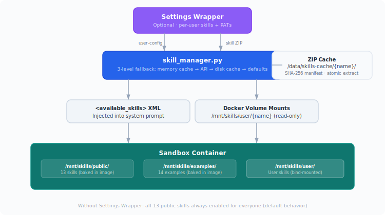

# Dynamic Per-User Skill Injection

System that fetches user-enabled skills and injects them into sandbox containers at runtime.



## How it works

1. **On chat start**, the server calls `skill_manager.get_user_skills(email)`
2. **Skill list** is fetched with 3-level fallback: memory cache (60s TTL) → Settings Wrapper API → disk cache → hardcoded defaults
3. **System prompt** gets `<available_skills>` XML block with skill names, descriptions, and paths
4. **User-uploaded skills** are downloaded as ZIP, cached locally, and bind-mounted into the container

Without Settings Wrapper, all 13 public skills are always enabled for everyone.

## Skill Categories

| Category | Storage | Mount Point | Source |
|----------|---------|-------------|--------|
| `public` | Baked in Docker image | `/mnt/skills/public/{name}/` | `skills/public/` |
| `example` | Baked in Docker image | `/mnt/skills/examples/{name}/` | `skills/examples/` |
| `user` | Host cache `/data/skills-cache/` | `/mnt/skills/user/{name}/` | ZIP from Settings Wrapper |

## Core Functions (skill_manager.py)

| Function | Purpose |
|----------|---------|
| `get_user_skills(email)` | Fetch enabled skills (async, 3-level fallback) |
| `get_user_skills_sync(email)` | Sync version (reads cache only, for Docker thread) |
| `ensure_skill_cached(skill)` | Download + extract user-uploaded ZIP |
| `build_available_skills_xml(skills)` | `<available_skills>` XML for system prompt |
| `build_sub_agent_skills_text(skills)` | Skill list for sub-agent prompt |
| `get_skill_mounts(skills)` | Docker volume mounts dict for user skills |

## API Endpoints

| Endpoint | Purpose |
|----------|---------|
| `GET /system-prompt?user_email=X&chat_id=Y` | Dynamic system prompt with user's skills |
| `GET /skill-mounts?user_email=X` | Docker volume mounts for user skills |
| `GET /skill-list?user_email=X` | Skills list for sub-agent prompt |

## ZIP Cache

- **Location**: `/data/skills-cache/{skill-name}/`
- **Manifest**: `.manifest.json` (name → SHA-256 + timestamp)
- **Atomic extraction**: unzip to temp dir → rename to final path
- **Stale cache reuse**: if API/download fails but old cache exists, use it
- **Host path**: Docker daemon needs host paths for bind mounts — configured via `SKILLS_CACHE_HOST_PATH`

## Configuration

| Variable | Default | Description |
|----------|---------|-------------|
| `MCP_TOKENS_URL` | _(empty)_ | Settings Wrapper URL |
| `MCP_TOKENS_API_KEY` | _(empty)_ | Internal API key |
| `SKILLS_CACHE_DIR` | `/data/skills-cache` | Container-internal cache path |
| `SKILLS_CACHE_HOST_PATH` | `/tmp/skills-cache` | Host path for Docker mounts |

## Verification

```bash
# Check system prompt (should list skills)
curl "http://localhost:8081/system-prompt?user_email=admin@open-computer-use.dev&chat_id=test" | head -50

# Check skill mounts
curl "http://localhost:8081/skill-mounts?user_email=admin@open-computer-use.dev"

# Check skill list
curl "http://localhost:8081/skill-list?user_email=admin@open-computer-use.dev"
```

## Related Docs

- [SKILLS.md](SKILLS.md) — reference for all built-in skills
- [SKILLS-USER-GUIDE.md](SKILLS-USER-GUIDE.md) — user guide for skills
- [settings-wrapper/README.md](../settings-wrapper/README.md) — mock skill registry API
