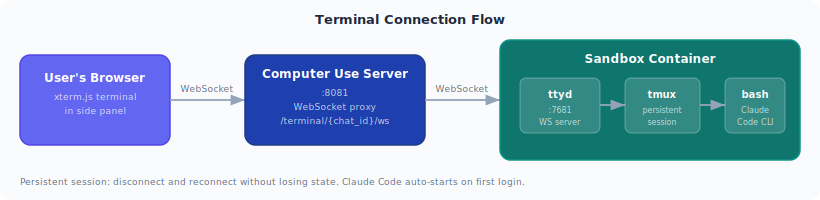
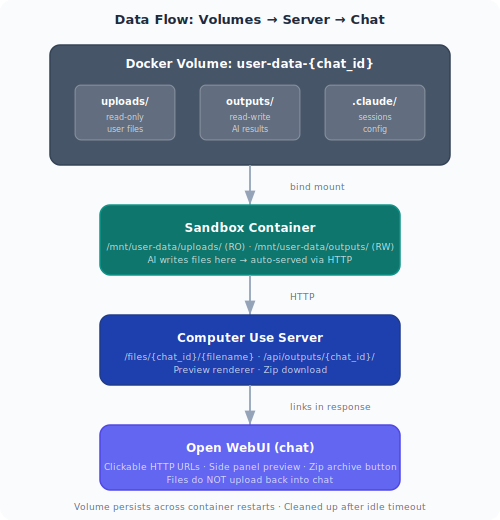

# Architecture & Features

How Open Computer Use works under the hood. For comparisons with other tools, see [COMPARISON.md](COMPARISON.md).

## Shared Browser

One Chromium instance inside the sandbox container, shared between the AI and the user:

| Actor | Access | What they do |
|-------|--------|--------------|
| **AI Agent** | Playwright CDP | Navigates, clicks, fills forms, scrapes data |
| **User** | CDP stream (interactive, side panel) | Watches AI in real-time, clicks, types, scrolls — same browser session |

The user can enter sensitive information (passwords, 2FA codes, private data) directly into the browser — the AI never sees the raw credentials, only the resulting page state. Both the AI and the user operate on the same browser — true collaboration, not a screenshot relay.

## File Flow & Preview

### How files work

1. **AI creates files** inside the sandbox container (`/mnt/user-data/outputs/`)
2. **Computer Use Server** serves files via HTTP (`/files/{chat_id}/filename`)
3. **Chat shows links** — the AI's response contains clickable HTTP URLs to the files
4. **Side panel renders preview** — docx, pdf, xlsx, images, code are rendered inline
5. **User downloads** by clicking the link or using the archive/zip endpoint

### Key design: files stay on the server

Files live on the server, not in the conversation. The chat only contains links. This means:

- **No file size limits** in chat — the server handles arbitrarily large files
- **Direct access** — open any file URL in a new browser tab
- **Zip download** — download all outputs as a single archive
- **No re-upload** — files don't flow back into the client's storage

## Claude Code CLI

The sandbox container has **Claude Code CLI pre-installed**. Users can access it in two ways:

1. **Via sub_agent tool** — the AI delegates complex tasks to Claude Code autonomously
2. **Via terminal tab** — the user opens the terminal in the side panel and runs Claude Code manually

### When to use the terminal

- Complex refactoring that requires many file edits
- Debugging with interactive tools (gdb, pdb, node inspect)
- Git operations (rebase, merge, cherry-pick)
- Running Claude Code with specific flags or prompts
- Working with MCP servers that the chat model doesn't support
- Simply preferring a CLI workflow

### How it works

- **tmux** keeps the session alive — disconnect and reconnect without losing state
- **Claude Code** has access to all configured MCP servers (auto-generated `~/.mcp.json`)
- User can **switch between chat and terminal** freely — both modify the same container filesystem

### The escape hatch

Users can leave the chat interface entirely:
- Open the server URL directly in a browser tab
- Navigate to `/terminal/{chat_id}/` for a full-screen terminal
- Work with files, run code, use Claude Code CLI — all independent of the chat interface

## Preview & Artifacts Panel

The side panel in Open WebUI serves three functions:

| Tab | Content | Source |
|-----|---------|--------|
| **Files** | Preview of created documents (docx, pdf, xlsx, images, code) | Computer Use Server `/api/outputs/{chat_id}/` |
| **Browser** | Live CDP stream of Chromium in the sandbox | Computer Use Server `/browser/{chat_id}/` |
| **Sub-Agent** | Terminal (ttyd) + Claude Code process dashboard | Computer Use Server `/terminal/{chat_id}/` |

### How preview rendering works

1. AI creates a file (e.g. `report.docx`) via `create_file` tool
2. The filter function detects the file URL in the response
3. Side panel opens automatically with the preview URL
4. Server renders preview: LibreOffice converts docx to HTML, pdf is embedded, images are displayed
5. User sees the result inline without downloading

## File Transfer & Sync

- **Everything is on the server** — Docker volumes, not local filesystem
- **Container sees volumes as mounts** — `/mnt/user-data/uploads/` (user uploads, read-only) and `/mnt/user-data/outputs/` (AI outputs, read-write)
- **Server serves files via HTTP** — no direct filesystem access from the browser
- **Chat only has links** — lightweight, no file data in the conversation
- **Volume persists** — survives container restarts, available until cleanup

## Docker Image Size

The sandbox image (`open-computer-use:latest`) is **~11 GB**. It includes a full Ubuntu 24.04 environment with LibreOffice, Playwright + Chromium, Claude Code CLI, Python ML/data science stack, Node.js toolchain, OCR, media processing, and 13 skills. First build takes ~15 minutes.
