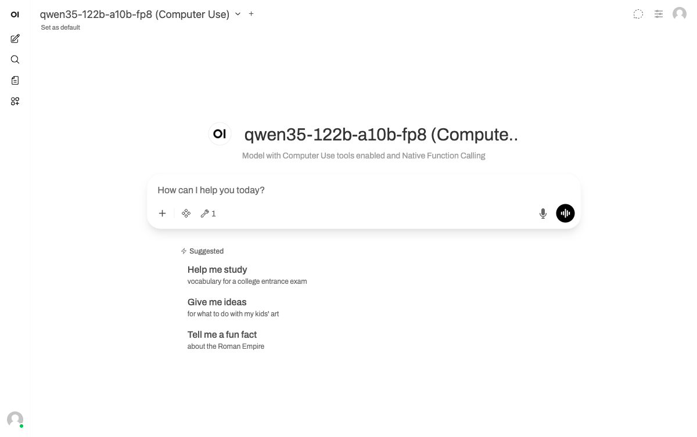

# Screenshots

Visual guide to Open Computer Use with Open WebUI.

## Chat Overview

Main Open WebUI interface with Computer Use model selected. The model has tools enabled (shown by the tool icon with "1" badge) and Native Function Calling configured.

## Document Creation

AI creating a Word document via tool calls. The flow:
1. User asks to create a document
2. Model reads the SKILL.md (via `view` tool) to understand the docx skill
3. Model creates the file (via `create_file` and `bash_tool`)
4. Response includes a "View your document" link and "Download all files as archive" button
5. Preview panel auto-opens on the right showing the document content

## File Preview

The preview panel (artifacts viewer) showing document content:
- **Files tab** — lists all output files with size and type
- Renders document content inline (Word, PDF, Excel, images, code)
- Download individual files or all as ZIP archive
- "Open in new tab" for full-screen preview

## Browser Viewer

The Browser tab in the preview panel:
- AI can open websites via `playwright-cli` or `bash_tool` with Playwright
- Live browser view via Chrome DevTools Protocol (CDP) proxy
- User can see what the AI sees in real-time
- Supports clicking, form filling, and navigation

## Sub-Agent (Claude Code)

The Sub-agent tab for autonomous task delegation:
- **Claude Code** runs in an isolated container with full tool access
- Can write code, create files, run tests, iterate until done
- "Open terminal" — interactive terminal session via WebSocket
- "Skip permission prompts" — dangerous mode for fully autonomous execution
- MCP servers and skills are automatically available to the sub-agent
